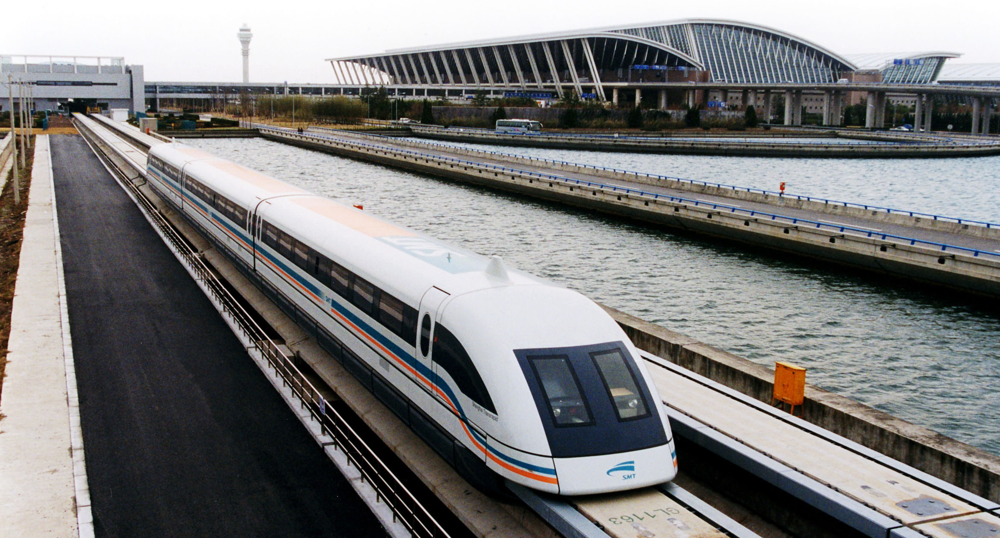
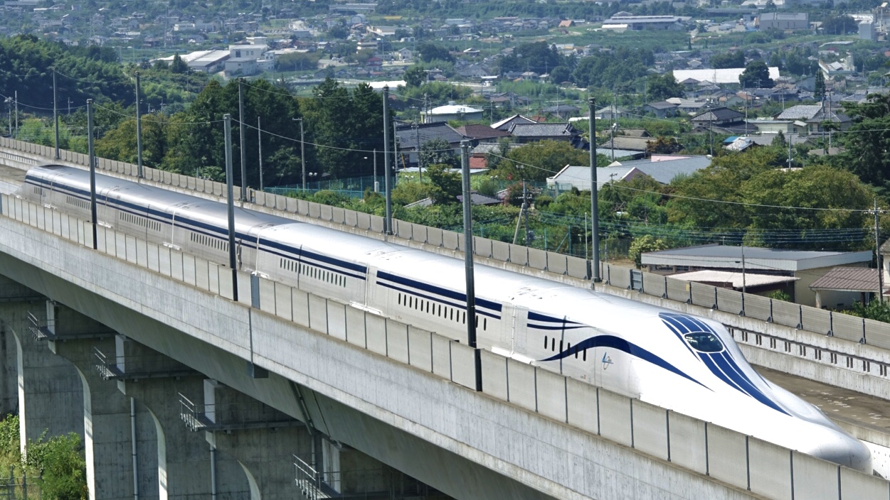
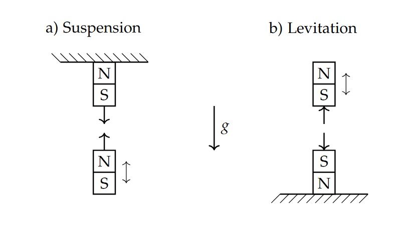
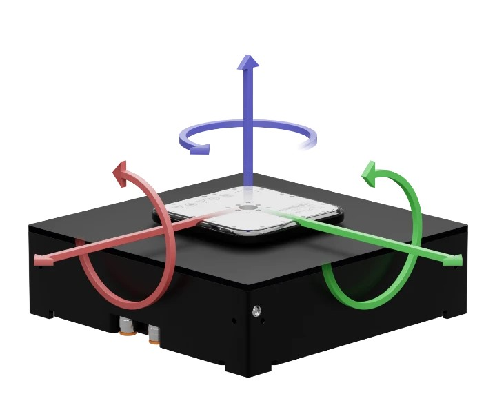
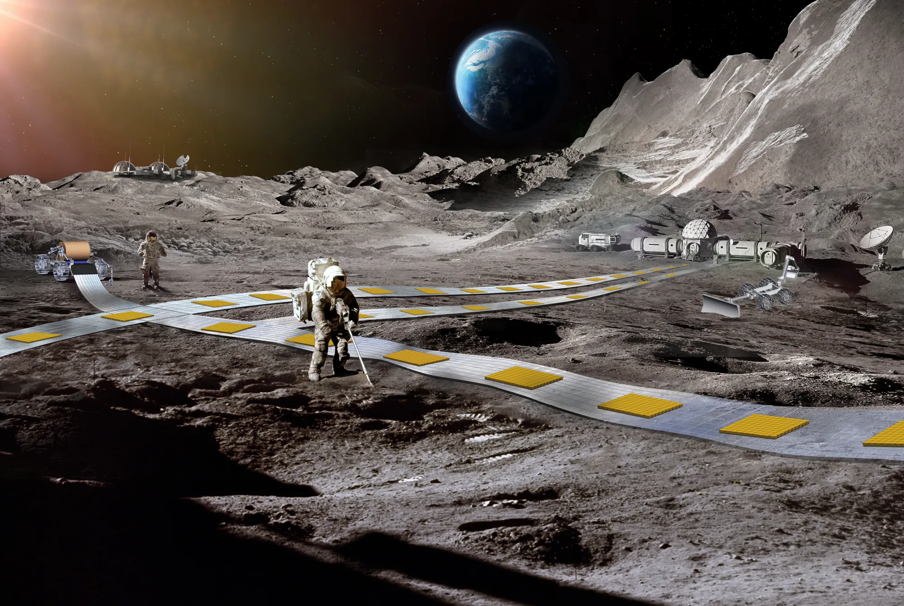
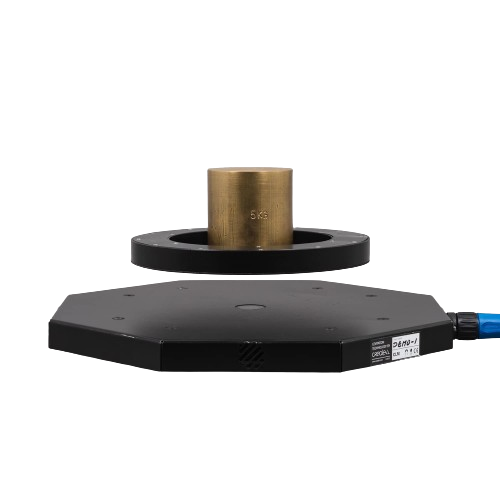
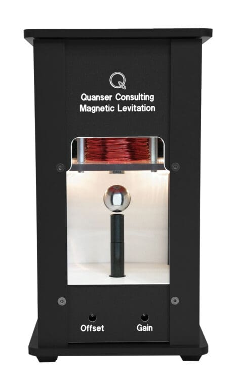

# A Brief History of Magnetic Levitation Technology

```{note} This is an abstract from the MAGGY - Hands on control learning with a maglev system
```

<div style="display: flex;">
  <div style="flex: 2; padding: 10px; border-right: 1px solid #ccc;">
   <p>Maggy is far from being the first magnetic levitation system to be created.
In this chapter, we outline some other types of magnetic levitation systems and technology and discuss how Maggy fits in.
Most of the history and theory can be found in the book by Han and Kim<sup>1</sup></p>
<h4>The Birth of <i>Maglev</i></h4>

<p>The word Maglev was first introduced and popularized in the early
20th century as a term to describe a type of high-speed train that
relies on magnetic levitation to reduce friction.</p>

<p> The first commercial Maglev train, the Transrapid, was developed
in Germany and began operations in 1984. This train was an elec-
tromagnetic maglev. Instead of wheels, the Transrapid had a set of
electromagnets that wrapped around the train lines, and the train
levitated through the attractive force between these magnets and elec-
tromagnets in the tracks. This, combined with a linear motor propul-
sive system, has allowed the most recent version of the Transrapid
system to reach speeds up to 505 km/h.</p>

<p>Since the Transrapid, there has been an explosion in the devel-
opment of Maglev train technology, with the most promising being
electrodynamic maglev trains. Instead of lifting coils, these trains rely
on superconductors to passively levitate above or between a set of
guiding coils. These coils are not actively controlled, but act effec-
tively as permanent magnets that perfectly oppose the magnetic field
of the superconductors once the train reaches a certain speed, due
to induced current from the superconductors. As with the electro-
magnetic maglevs, propulsion is achieved with a linear motor, while
propulsion below the levitation speed is achieved using conventional
wheels. The electrodynamic levitation technology allows for bet-
ter stability and lower cost levitation, with trains already reaching
speeds of up to 607 km/h.</p>

  </div>
  <div style="flex: 1; padding: 10px; margin-top: 10vh">
    <p><sup>1</sup>T Hyung-Suk Han and Dong-Sung
    Kim. Magnetic levitation, volume 247.
    Springer, 2016</p>

  
  <p> Figure 4.1: The world-famousShanghai airport maglev
  train is an 08 series Tran-
  srapid [Xplore, 2024]</p>

  
  <p> Figure 4.2: The Ch ¯u ¯o
Shinkansen is an electrody-
namic maglev that is set to
start operation between Tokyo
and Nagoya in Japan from
2027 [Museum, 2024] </p>
  </div>
</div>

 <div style="display: flex;">
  <div style="flex: 2; padding: 10px; border-right: 1px solid #ccc;">
    <h3> Modes of magnetic levitation </h3>
    <p>
      The above outlines two important magnetic levitation concepts; elec-
tromagnetic suspension and electromagnetic levitation. As illustrated in
Figure 4.3, suspension simply alludes to the fact that something is
suspended (against gravity) using magnetic attraction, while levita-
tion uses magnetic repulsion to counteract the gravitational force. As 
already mentioned, the Transrapid is a perfect example of the for-
mer, while electrodynamic maglevs rely somewhat on both of these
concepts to achieve levitation.
    </p>
  
  <p>
  The above concepts are examples of static magnetic levitation. A
famous theorem by Samuel Ernshaw states that it is not possible to
achieve stable levitation using any configuration of magnets with
fixed magnetization.<sup>2</sup> Thus, any static levitation system relies on
some sort of external corrective force for levitate. This is usually
where the electro part comes in; stability is usually solved by mea-
suring the position of the levitating magnet and stabilizing it using a
controller to adjust the current in electromagnetic solenoids. Suspen-
sion systems are naturally stable in the lateral direction (like a pen-
dulum), and thus only require vertical corrective action, while levi-
tation systems are unstable in the lateral direction (like an inverted
pendulum), and thus require lateral stabilization. In the following,
we will see examples of how the concepts above are commonly ap-
plied in industrial and commercial systems.
  </p>
  </div>
  <div style="flex: 1; padding: 10px; margin-top: 60vh">
  <p>
  Figure 4.3: A comparison be-
tween magnetic suspension and
magnetic levitation.
  </p>
  <p style = "margin-top: 30vh">
  <sup>2</sup> Roberto Bassani. Earnshaw (1805–
1888) and passive magnetic levitation.
Meccanica, 41:375–389, 2006
  </p>
  </div>
</div>
<div style="display: flex;">
  <div style="flex: 2; padding: 10px; border-right: 1px solid #ccc;">
  <h3>Maglev in Science & Industry</h3>
  <p>A good example of magnetic suspension in an industrial setting is
magnetic bearings. These bearings use electromagnets to actively
control the position of the rotor to be in the center of the bearing,
allowing for near frictionless rotation. However, the additional bulk
and complexity added by the suspension system make these bearings
large and expensive, and they are therefore mostly used in costly
and high-precision devices, including medical equipment, industrial
machinery, and scientific instruments.</p>
<p>
  A planar motor, such as those offered by Planar Motors Inc. and
  Beckhoff <sup>3</sup>, is a more sophisticated application of magnetic levitation.
  These consist of a magnetic mover that is levitating very close to a
base filled with electromagnets. These motors operate on a flat sur-
face and can move in multiple directions without physical contact,
offering high precision and flexibility. Planar motors are essential in
industries that require precise positioning and high-speed motion,
such as semiconductor manufacturing and automated assembly lines.
  </p>
  <p>NASA’s Flexible Levitation on a Track (FLOAT) system offers a
unique application of magnetic levitation. This system is a conceptual
magnetic road that can be rolled out onto the lunar surface for
the transportation of material when future moon bases are to be
constructed. Like planar motors, the roads are magnetic bases with
small loaded carts levitating above them. Unlike planar motors and
most other commercial uses of magnetic levitation technology, the
levitation is achieved passively using diamagnetism, circumventing
Earnshaw’s theorem and allowing for levitation without the use of
electromagnets. </p>
<p>Magnetic levitation technology is also hugely important in other
fields of science. Aside from the use of planar motors for the pre-
cise movement of scientific equipment and components, the most
prominent use of magnetic levitation is the concept of magnetic con-
finement. The two largest research projects today — the CERN Large
Hadron Collider and the ITER Tokamak fusion reactor — would both
not be possible without magnetic confinement to guide particles/-
plasma without physical contact.<sup>4</sup> </p>
  </div>
  <div style="flex: 1; padding: 10px; margin-top: 10vh">
    
    <p>
    Figure 4.4: An illustration of
a planar motor developed by
Planar Motors Inc. [PMI, 2024]
    </p>
    <p>
    <sup>3</sup> PMI. Planar motors, 2024. URL
https://planarmotor.com/en. Ac-
cessed: 2024-05-25; and Beckhoff Au-
tomation. Beckhoff - xplanar planar
motor system, 2024. <a href="https:
//www.beckhoff.com/en-en/products/
motion/xplanar-planar-motor-system">URL. </a>
Accessed: 2024-05-25
    </p>
    
    <p> Figure 4.5: An illustration
of NASA’s FLOAT con-
cept [NASA, 2024]</p>
<p style = "margin-top: 16vh">
<sup>4</sup> ITER Organization. Iter - the machine,
2024. URL https://www.iter.org/mach.
Accessed: 2024-05-28; and CERN. Cern
  - the large hadron collider,
 2024. <a href="https://www.home.cern/science/accelerators/large-hadron-collider">URL.</a>
  Accessed: 2024-05-28
</p>
  </div>
</div>
<div style="display: flex;">
  <div style="flex: 2; padding: 10px; border-right: 1px solid #ccc;">
  <h3>Maglev in Consumer Products</h3>
  <p>Maglev technology has also made its way into consumer products.
For the most part, these are almost direct applications of the suspension and levitation concepts mentioned above and are mostly
used as novelty ornaments or display cases. A common example that
most people are probably familiar with is a floating globe suspended
below an electromagnet.</p>
<p>More relevant for us, though, are the systems that rely on magnetic
levitation. These systems typically consist of a base equipped with
electromagnets and/or permanent magnets, and optical or magnetic
sensors, that keep a permanent magnet levitating stably above the
base. Among these is Levimoon, which sells magnetically levitating
moons that light up using battery power.<sup>5</sup> Floately and Flyte are known for their floating lightbulbs that are cleverly designed to light
up using magnetic induction.<sup>6</sup> The latter offers a range of levitation
platforms that can even keep a magnet levitating in any orientation.
Having enough power to lift heavy objects is a common issue, and
so the company Crealev specializes in magnetic levitation modules
that are capable of lifting heavy loads with a large gap between the
levitating magnet and the base.<sup>7</sup> </p>
  </div>
  <div style="flex: 1; padding: 10px; margin-top: 0vh">
  
  <p>Figure 4.6: The Crealev Octo88
levitation module, capable of
lifting a load of 10 kg [Crealev,
2024]</p>
<p><sup>5</sup> Levimoon. Levimoon, 2024. URL
http://ww.levimoon.com/. Accessed:
2024-05-24</p>
<p>
<sup>6</sup> Floately. Floately, 2024. URL https:
//www.floately.com/. Accessed: 2024-
05-24; and Flyte. Flyte, 2024. URL
https://flytestore.com/. Accessed:
2024-05-24</p>
<p><sup>7</sup> Crealev. Crealev, 2024. URL https:
//www.crealev.com/. Accessed: 2024-
06-04</p>
  </div>
</div>
<div style="display: flex;">
<div style="flex: 2; padding: 10px; border-right: 1px solid #ccc;">
<h3>Maglev in Education & Maggy</h3>
<p>In terms of teaching, there are not many alternatives offered for small
magnetic levitation systems. As far as the authors know, the only
available magnetic levitation system for this is the Quanser magnetic
suspension lab.<sup>8</sup> Quanser is a leader in engineering education soluions and offers this lab as part of their portfolio, to allow students
to study the principles of magnetic levitation and control systems in
a hands-on environment. This platform is widely used in universi-
ties and research institutions for teaching and research purposes. It
is a magnetic suspension system where an iron ball is lifted using an
electromagnet and an optical sensor. They offer a comprehensive lab
guide and seamless integration into Matlab and Simulink. However,
their lab is proprietary, and each unit can be very costly. Further-
more, the suspension design effectively makes this a 1DOF system,
limiting the potential applications and educational benefits.</p>
<p> In contrast, Maggy is a magnetic levitation system, similar to the
more common commercial levitation platforms mentioned above,
that is not proprietary, and it is designed to be cheap enough for
students to build themselves or bring home.</p>
  </div>
  <div style="flex: 1; padding: 10px; margin-top: 0vh">
  
  <p>Figure 4.7: The Quanser mag-
netic suspension lab [Quanser,
2024]</p>
  </div>
</div>

